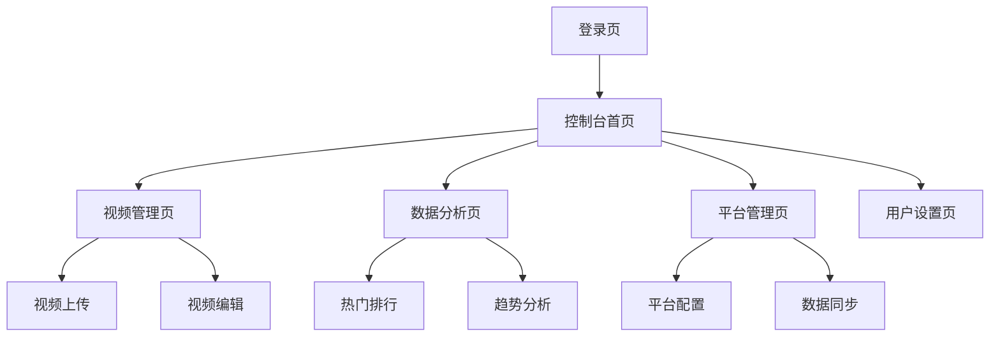

## 1. 产品概述

多平台短视频管理与数据分析系统是一个集成化的内容管理平台，帮助内容创作者和运营团队统一管理来自抖音、快手等平台的短视频内容，并提供全面的数据分析功能。

该系统解决了多平台内容分散、数据孤岛、分析困难等问题，为短视频运营者提供一站式内容管理和数据洞察服务，提升运营效率和内容质量。

## 2. 核心功能

### 2.1 用户角色

| 角色 | 注册方式 | 核心权限 |
|------|----------|----------|
| 普通用户 | 邮箱注册 | 视频上传、基础数据统计查看 |
| 高级用户 | 邀请码升级 | 高级分析功能、多平台数据接入 |
| 管理员 | 后台创建 | 系统管理、用户管理、数据全权限 |

### 2.2 功能模块

系统包含以下核心页面：

1. **登录注册页**：用户认证、权限验证
2. **控制台首页**：数据概览、快捷操作
3. **视频管理页**：视频列表、上传编辑、分类标签
4. **数据分析页**：热门排行、趋势分析、用户行为
5. **平台管理页**：多平台配置、数据同步
6. **用户设置页**：个人信息、权限管理

### 2.3 页面详情

| 页面名称 | 模块名称 | 功能描述 |
|----------|----------|----------|
| 登录注册页 | 用户认证 | 支持邮箱注册、密码登录、验证码验证 |
| 控制台首页 | 数据概览 | 显示视频总数、播放量、互动数据等核心指标 |
| 控制台首页 | 快捷操作 | 快速上传、查看最新视频、热门分析入口 |
| 视频管理页 | 视频列表 | 展示所有视频，支持搜索、筛选、排序 |
| 视频管理页 | 视频上传 | 支持批量上传、封面设置、基础信息编辑 |
| 视频管理页 | 分类标签 | 创建管理分类，添加删除标签 |
| 数据分析页 | 热门排行 | 按播放量、点赞数等维度展示热门视频 |
| 数据分析页 | 趋势分析 | 展示数据变化趋势图表 |
| 数据分析页 | 用户行为 | 分析用户观看习惯和互动行为 |
| 平台管理页 | 平台配置 | 配置抖音、快手等平台接入参数 |
| 平台管理页 | 数据同步 | 手动或自动同步各平台数据 |
| 用户设置页 | 个人信息 | 修改昵称、头像、密码等基础信息 |
| 用户设置页 | 权限管理 | 管理员可管理用户权限和角色 |

## 3. 核心流程

### 用户操作流程

1. **新用户流程**：注册账号 → 登录系统 → 上传视频 → 查看数据 → 分析优化
2. **老用户流程**：登录系统 → 管理视频 → 查看分析 → 调整策略 → 同步多平台

### 管理员流程

登录系统 → 用户管理 → 系统配置 → 数据监控 → 权限分配

## 4. 用户界面设计

### 4.1 设计风格

- **主色调**：深蓝色（#1890ff）配白色背景
- **按钮样式**：圆角矩形，悬停动画效果
- **字体**：系统默认字体，主要字号14-16px
- **布局风格**：左侧导航 + 右侧内容区的经典管理后台布局
- **图标风格**：使用Ant Design图标库，简洁线性风格

### 4.2 页面设计概览

| 页面名称 | 模块名称 | UI元素 |
|----------|----------|----------|
| 控制台首页 | 数据卡片 | 彩色渐变卡片展示核心数据，包含图标和数值 |
| 视频管理页 | 视频卡片 | 网格布局展示视频缩略图，悬停显示操作按钮 |
| 数据分析页 | 图表区域 | 使用ECharts展示各类数据图表，支持交互 |
| 平台管理页 | 平台卡片 | 平台logo和状态指示器，简洁列表展示 |

### 4.3 响应式设计

- **桌面优先**：默认适配1920x1080分辨率
- **移动端适配**：支持平板和手机访问，自适应布局
- **触摸优化**：移动端优化按钮大小和交互方式