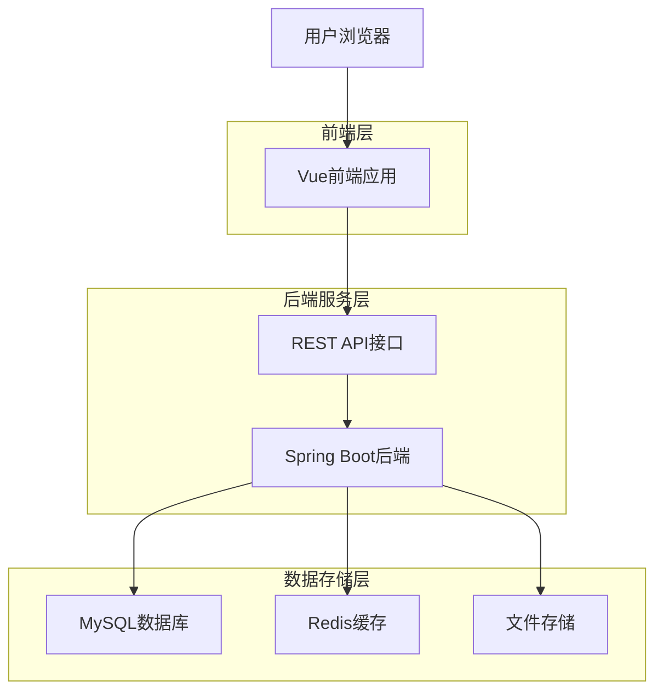
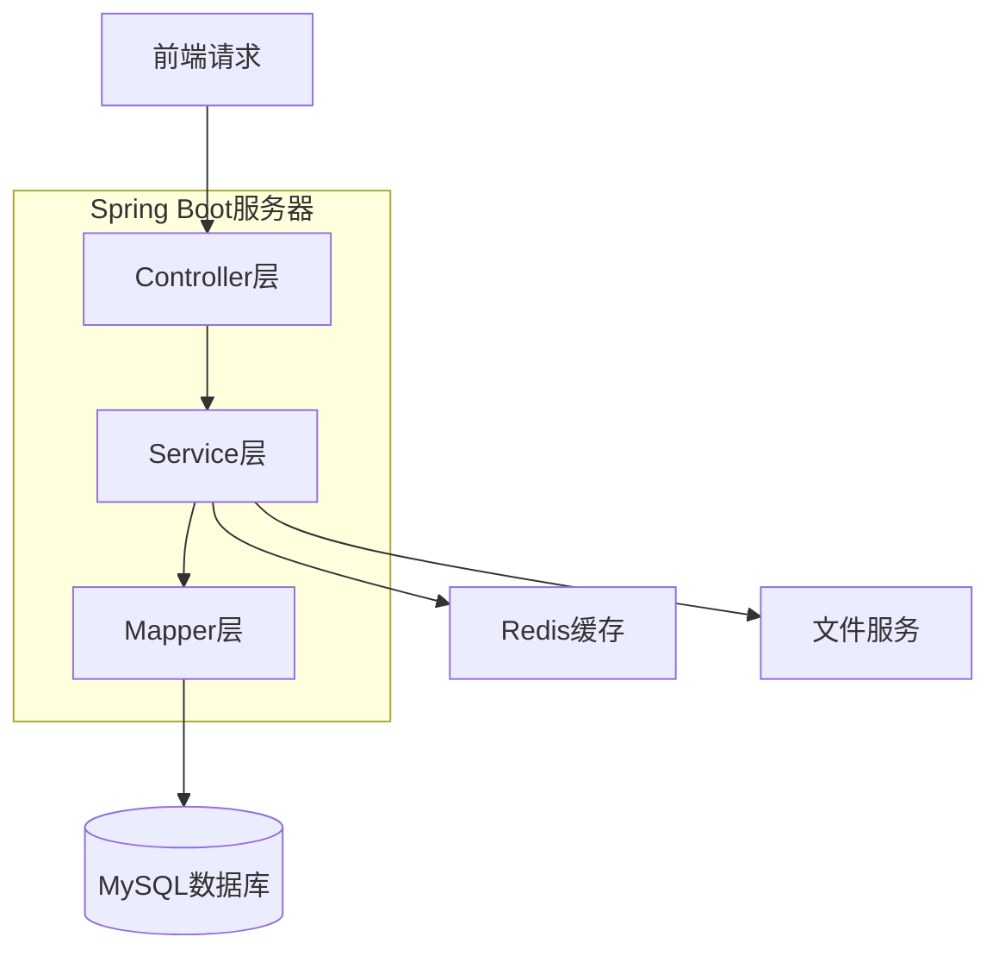
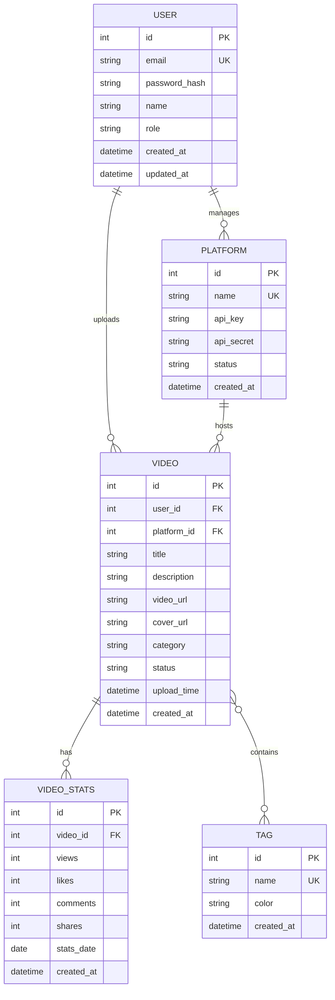

## 1. 架构设计



## 2. 技术描述

- **前端**: Vue@3 + Element Plus + Vite
- **初始化工具**: Vite
- **后端**: Spring Boot@2.7 + MyBatis Plus + MySQL
- **数据库**: MySQL@8.0
- **缓存**: Redis@6.0
- **文件存储**: 本地存储/阿里云OSS

## 3. 路由定义

| 路由 | 用途 |
|------|------|
| / | 登录页 |
| /dashboard | 控制台首页 |
| /videos | 视频管理页 |
| /analysis | 数据分析页 |
| /platforms | 平台管理页 |
| /settings | 用户设置页 |

## 4. API接口定义

### 4.1 用户认证相关

```
POST /api/auth/register
```

Request:
| 参数名 | 参数类型 | 是否必需 | 描述 |
|--------|----------|----------|------|
| email | string | 是 | 用户邮箱 |
| password | string | 是 | 密码 |
| name | string | 是 | 用户昵称 |

Response:
| 参数名 | 参数类型 | 描述 |
|--------|----------|------|
| success | boolean | 注册状态 |
| message | string | 返回信息 |
| data | object | 用户数据 |

### 4.2 视频管理相关

```
GET /api/videos/list
```

Request:
| 参数名 | 参数类型 | 是否必需 | 描述 |
|--------|----------|----------|------|
| page | number | 否 | 页码，默认1 |
| size | number | 否 | 每页数量，默认10 |
| category | string | 否 | 分类筛选 |
| platform | string | 否 | 平台筛选 |

Response:
| 参数名 | 参数类型 | 描述 |
|--------|----------|------|
| success | boolean | 请求状态 |
| data | array | 视频列表数据 |
| total | number | 总数量 |

### 4.3 数据分析相关

```
GET /api/analysis/hot-videos
```

Request:
| 参数名 | 参数类型 | 是否必需 | 描述 |
|--------|----------|----------|------|
| days | number | 否 | 统计天数，默认7 |
| platform | string | 否 | 平台筛选 |

Response:
| 参数名 | 参数类型 | 描述 |
|--------|----------|------|
| success | boolean | 请求状态 |
| data | array | 热门视频排行数据 |

## 5. 后端架构图



## 6. 数据模型

### 6.1 数据模型定义



### 6.2 数据定义语言

用户表 (users)
```sql
-- 创建用户表
CREATE TABLE users (
  id BIGINT PRIMARY KEY AUTO_INCREMENT,
  email VARCHAR(255) UNIQUE NOT NULL,
  password_hash VARCHAR(255) NOT NULL,
  name VARCHAR(100) NOT NULL,
  role VARCHAR(20) DEFAULT 'user' CHECK (role IN ('user', 'admin')),
  avatar_url VARCHAR(500),
  created_at TIMESTAMP DEFAULT CURRENT_TIMESTAMP,
  updated_at TIMESTAMP DEFAULT CURRENT_TIMESTAMP ON UPDATE CURRENT_TIMESTAMP
);

-- 创建索引
CREATE INDEX idx_users_email ON users(email);
CREATE INDEX idx_users_role ON users(role);
```

视频表 (videos)
```sql
-- 创建视频表
CREATE TABLE videos (
  id BIGINT PRIMARY KEY AUTO_INCREMENT,
  user_id BIGINT NOT NULL,
  platform_id BIGINT NOT NULL,
  title VARCHAR(255) NOT NULL,
  description TEXT,
  video_url VARCHAR(500) NOT NULL,
  cover_url VARCHAR(500),
  category VARCHAR(50),
  status VARCHAR(20) DEFAULT 'active' CHECK (status IN ('active', 'deleted', 'private')),
  upload_time TIMESTAMP DEFAULT CURRENT_TIMESTAMP,
  created_at TIMESTAMP DEFAULT CURRENT_TIMESTAMP,
  updated_at TIMESTAMP DEFAULT CURRENT_TIMESTAMP ON UPDATE CURRENT_TIMESTAMP,
  FOREIGN KEY (user_id) REFERENCES users(id),
  FOREIGN KEY (platform_id) REFERENCES platforms(id)
);

-- 创建索引
CREATE INDEX idx_videos_user_id ON videos(user_id);
CREATE INDEX idx_videos_platform_id ON videos(platform_id);
CREATE INDEX idx_videos_category ON videos(category);
CREATE INDEX idx_videos_status ON videos(status);
CREATE INDEX idx_videos_upload_time ON videos(upload_time);
```

视频统计表 (video_stats)
```sql
-- 创建视频统计表
CREATE TABLE video_stats (
  id BIGINT PRIMARY KEY AUTO_INCREMENT,
  video_id BIGINT NOT NULL,
  views BIGINT DEFAULT 0,
  likes BIGINT DEFAULT 0,
  comments BIGINT DEFAULT 0,
  shares BIGINT DEFAULT 0,
  stats_date DATE NOT NULL,
  created_at TIMESTAMP DEFAULT CURRENT_TIMESTAMP,
  FOREIGN KEY (video_id) REFERENCES videos(id),
  UNIQUE KEY unique_video_date (video_id, stats_date)
);

-- 创建索引
CREATE INDEX idx_stats_video_id ON video_stats(video_id);
CREATE INDEX idx_stats_date ON video_stats(stats_date);
CREATE INDEX idx_stats_views ON video_stats(views);
```

标签表 (tags)
```sql
-- 创建标签表
CREATE TABLE tags (
  id BIGINT PRIMARY KEY AUTO_INCREMENT,
  name VARCHAR(50) UNIQUE NOT NULL,
  color VARCHAR(7) DEFAULT '#1890ff',
  created_at TIMESTAMP DEFAULT CURRENT_TIMESTAMP
);

-- 创建索引
CREATE INDEX idx_tags_name ON tags(name);
```

视频标签关联表 (video_tags)
```sql
-- 创建视频标签关联表
CREATE TABLE video_tags (
  id BIGINT PRIMARY KEY AUTO_INCREMENT,
  video_id BIGINT NOT NULL,
  tag_id BIGINT NOT NULL,
  created_at TIMESTAMP DEFAULT CURRENT_TIMESTAMP,
  FOREIGN KEY (video_id) REFERENCES videos(id),
  FOREIGN KEY (tag_id) REFERENCES tags(id),
  UNIQUE KEY unique_video_tag (video_id, tag_id)
);

-- 创建索引
CREATE INDEX idx_vt_video_id ON video_tags(video_id);
CREATE INDEX idx_vt_tag_id ON video_tags(tag_id);
```

平台表 (platforms)
```sql
-- 创建平台表
CREATE TABLE platforms (
  id BIGINT PRIMARY KEY AUTO_INCREMENT,
  name VARCHAR(50) UNIQUE NOT NULL,
  api_key VARCHAR(255),
  api_secret VARCHAR(255),
  webhook_url VARCHAR(500),
  status VARCHAR(20) DEFAULT 'active' CHECK (status IN ('active', 'inactive')),
  config_json TEXT,
  created_at TIMESTAMP DEFAULT CURRENT_TIMESTAMP,
  updated_at TIMESTAMP DEFAULT CURRENT_TIMESTAMP ON UPDATE CURRENT_TIMESTAMP
);

-- 创建索引
CREATE INDEX idx_platforms_name ON platforms(name);
CREATE INDEX idx_platforms_status ON platforms(status);
```

### 6.3 初始化数据

```sql
-- 插入初始平台数据
INSERT INTO platforms (name, api_key, api_secret) VALUES
('抖音', 'douyin_api_key_123', 'douyin_secret_456'),
('快手', 'kuaishou_api_key_789', 'kuaishou_secret_012'),
('B站', 'bilibili_api_key_345', 'bilibili_secret_678');

-- 插入初始标签数据
INSERT INTO tags (name, color) VALUES
('搞笑', '#ff4d4f'),
('美食', '#fa8c16'),
('旅行', '#52c41a'),
('科技', '#1890ff'),
('音乐', '#722ed1');
```

## 7. 后端目录结构

```
src/
├── main/
│   ├── java/com/shortvideo/
│   │   ├── controller/          # 控制器层
│   │   │   ├── AuthController.java
│   │   │   ├── VideoController.java
│   │   │   ├── AnalysisController.java
│   │   │   ├── PlatformController.java
│   │   │   └── UserController.java
│   │   ├── service/           # 服务层
│   │   │   ├── impl/          # 服务实现
│   │   │   ├── AuthService.java
│   │   │   ├── VideoService.java
│   │   │   ├── AnalysisService.java
│   │   │   ├── PlatformService.java
│   │   │   └── UserService.java
│   │   ├── mapper/            # 数据访问层
│   │   │   ├── UserMapper.java
│   │   │   ├── VideoMapper.java
│   │   │   ├── VideoStatsMapper.java
│   │   │   ├── TagMapper.java
│   │   │   └── PlatformMapper.java
│   │   ├── entity/            # 实体类
│   │   │   ├── User.java
│   │   │   ├── Video.java
│   │   │   ├── VideoStats.java
│   │   │   ├── Tag.java
│   │   │   └── Platform.java
│   │   ├── dto/               # 数据传输对象
│   │   │   ├── LoginDTO.java
│   │   │   ├── VideoUploadDTO.java
│   │   │   └── AnalysisResultDTO.java
│   │   ├── config/            # 配置类
│   │   │   ├── SecurityConfig.java
│   │   │   ├── MyBatisConfig.java
│   │   │   └── RedisConfig.java
│   │   ├── utils/             # 工具类
│   │   │   ├── JwtUtils.java
│   │   │   ├── FileUtils.java
│   │   │   └── DateUtils.java
│   │   └── ShortVideoApplication.java
│   └── resources/
│       ├── application.yml
│       ├── application-dev.yml
│       ├── application-prod.yml
│       └── mapper/            # MyBatis XML映射文件
└── test/
    └── java/com/shortvideo/